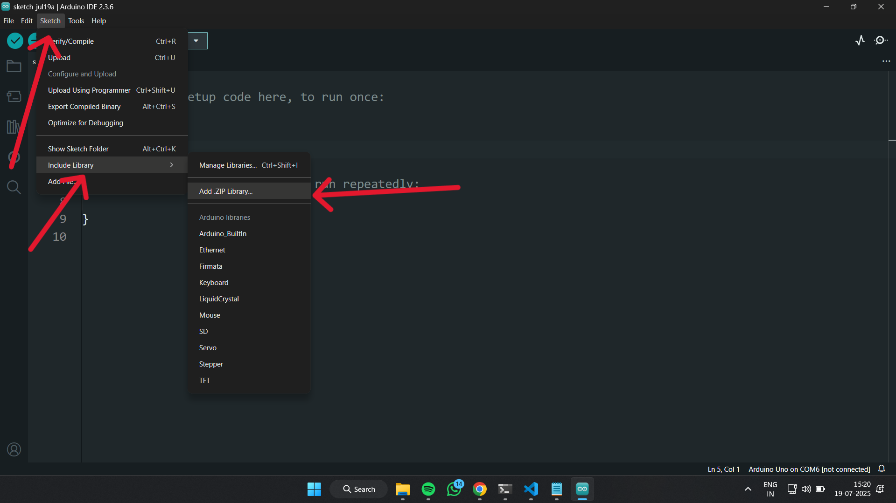
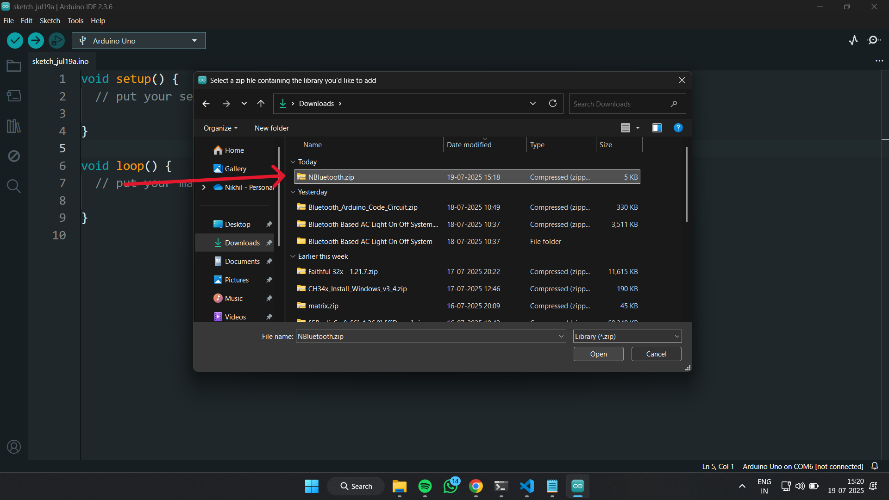
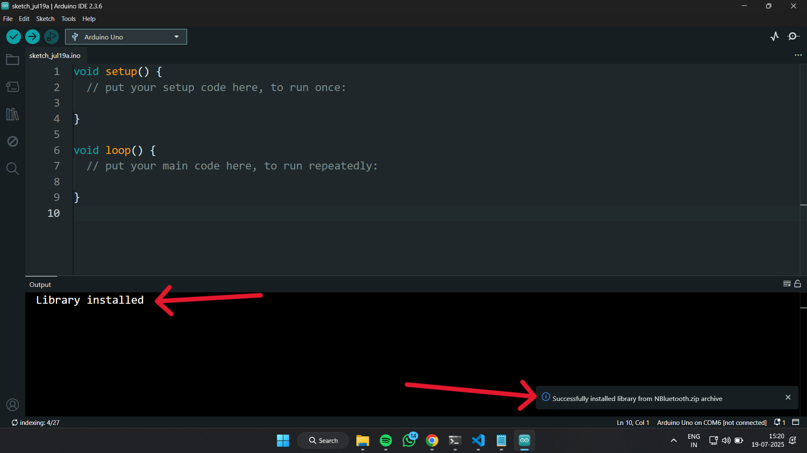
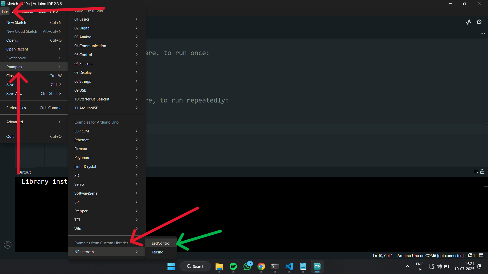

# NBluetooth -v1.0 - Arduino Bluetooth Wrapper Library

# Overview 
NBluetooth is a small and easy-to-use library that helps you connect your Arduino board to a Bluetooth module (like HC-05 or HC-06).  
It allows your Arduino to talk to your mobile phone or computer wirelessly and perform actions like turning an LED on or off.

# How to download
1. Go to the [Releases](https://github.com/karnikhil90/NBluetooth/releases) section of this GitHub repo.
2. Download the `.zip` file from the latest release.
3. Open Arduino IDE → `Sketch` → `Include Library` → `Add .ZIP Library...`
4. Select the downloaded zip to install the NBluetooth library.

# How to use in Arduino IDE

## 1️⃣ Download and save the library

 
<em align="center">Download from the release section and save</em>
    

## 2️⃣ Open in Ardunio IDE
 `Sketch` → `Include Library` → `Add .ZIP Library...`

 

<em align="center"></em>
    

## 3️⃣ Select the file and upload

 
<em align="center">Download from the release section and save</em>
    
    <em align="center">Successful Install</em>
    

## 4️⃣ Open an example from the Ardunio IDE
`File` → `Examples` → `Custom Library`→ `NBluetooth`

 
<em align="center"></em>
    

# 📄 License

This project is licensed under the MIT License - see the [LICENSE](LICENSE) file.

---

# 👨‍💻 About Me

Self-taught coder | Still Learning | Fluent in Java❤️ & Python | C/C++, Rust, & Basic Web Dev | Passionate about Embedded Systems ❤️

### 🌐 Connect with Me

    
